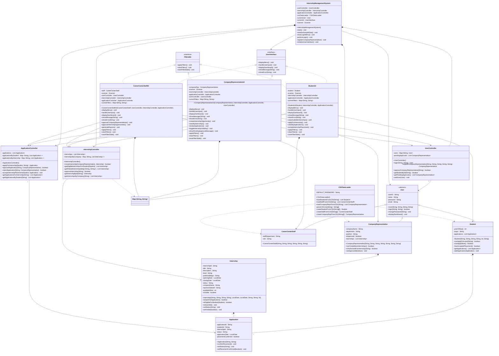

```mermaid
classDiagram
    %% ========== INTERFACES (ISP) ==========
    class UserInterface {
        <<interface>>
        +displayMenu() void
        +handleUserInput() void
        +displayDashboard() void
        +showMessage(String) void
        +showError(String) void
    }

    class Filterable {
        <<interface>>
        +applyFilters() void
        +clearFilters() void
        +saveFilterState() void
    }

    %% ========== ENTITIES (SRP) ==========
    class User {
        <<abstract>>
        -userID : String
        -name : String
        -password : String
        -email : String
        +User(String, String, String, String)
        +login(String, String) boolean
        +changePassword(String) void
        +displayDashboard()* void
    }

    class Student {
        -yearOfStudy : int
        -major : String
        -applications : List~Application~
        +Student(String, String, String, String, int, String)
        +canApplyForLevel(String) boolean
        +canApplyMore() boolean
        +hasAcceptedPlacement() boolean
        +getApplications() List~Application~
        +addApplication(Application) void
    }

    class CompanyRepresentative {
        -companyName : String
        -department : String
        -position : String
        -isApproved : boolean
        -internships : List~Internship~
        +CompanyRepresentative(String, String, String, String, String, String, String)
        +canCreateMoreInternships() boolean
        +isAuthorizedForInternship(String) boolean
        +setApproved(boolean) void
    }

    class CareerCenterStaff {
        -staffDepartment : String
        -role : String
        +CareerCenterStaff(String, String, String, String, String, String)
    }

    class Internship {
        -internshipId : String
        -title : String
        -description : String
        -level : String
        -preferredMajor : String
        -openingDate : LocalDate
        -closingDate : LocalDate
        -status : String
        -companyName : String
        -representativeId : String
        -availableSlots : int
        -isVisible : boolean
        +Internship(String, String, String, String, LocalDate, LocalDate, String, String, int)
        +isOpenForApplication() boolean
        +isEligibleForStudent(Student) boolean
        +reduceSlot() void
        +setStatus(String) void
        +setVisible(boolean) void
    }

    class Application {
        -applicationId : String
        -studentId : String
        -internshipId : String
        -status : String
        -applicationDate : LocalDate
        -placementConfirmed : boolean
        +Application(String, String)
        +confirmPlacement() void
        +setStatus(String) void
        +setPlacementConfirmed(boolean) void
    }

    %% ========== CONTROLLERS (SRP) ==========
    class UserController {
        -users : Map~String, User~
        -pendingApprovals : List~CompanyRepresentative~
        +UserController()
        +login(String, String) User
        +registerCompanyRepresentative(String, String, String, String, String) CompanyRepresentative
        +approveCompanyRepresentative(String) boolean
        +getStudentById(String) Student
        +getPendingApprovals() List~CompanyRepresentative~
        +addUser(User) void
    }

    class InternshipController {
        -internships : List~Internship~
        -internshipsByCompany : Map~String, List~Internship~~
        +InternshipController()
        +createInternship(CompanyRepresentative, Internship) boolean
        +getEligibleInternshipsForStudent(Student) List~Internship~
        +getFilteredInternships(Map~String, String~) List~Internship~
        +approveInternship(String) boolean
        +getInternshipById(String) Internship
        +getInternshipsByCompany(String) List~Internship~
    }

    class ApplicationController {
        -applications : List~Application~
        -applicationsByStudent : Map~String, List~Application~~
        -applicationsByInternship : Map~String, List~Application~~
        +ApplicationController()
        +applyForInternship(Student, String) Application
        +approveApplication(String, CompanyRepresentative) boolean
        +rejectApplication(String, CompanyRepresentative) boolean
        +acceptInternshipPlacement(Student, Application) void
        +getApplicationsForInternship(String) List~Application~
        +getApplicationsByStudent(String) List~Application~
    }

    %% ========== CSV DATA LOADER (SRP) ==========
    class CSVDataLoader {
        -DEFAULT_PASSWORD : String
        +CSVDataLoader()
        +loadStudentsFromCSV(String) List~Student~
        +loadStaffFromCSV(String) List~CareerCenterStaff~
        +loadCompanyRepsFromCSV(String) List~CompanyRepresentative~
        -parseCSVLine(String) String[]
        -createStudentFromCSV(String[]) Student
        -createStaffFromCSV(String[]) CareerCenterStaff
        -createCompanyRepFromCSV(String[]) CompanyRepresentative
    }

    %% ========== CONCRETE UI CLASSES ==========
    class StudentUI {
        -student : Student
        -scanner : Scanner
        -internshipController : InternshipController
        -applicationController : ApplicationController
        -currentFilters : Map~String, String~
        +StudentUI(Student, InternshipController, ApplicationController)
        +displayMenu() void
        +handleUserInput() void
        +displayDashboard() void
        +showMessage(String) void
        +showError(String) void
        +viewAvailableInternships() void
        +applyForInternship() void
        +viewMyApplications() void
        +acceptInternshipPlacement() void
        +applyFilters() void
        +clearFilters() void
        +saveFilterState() void
    }

    class CompanyRepresentativeUI {
        -companyRep : CompanyRepresentative
        -scanner : Scanner
        -internshipController : InternshipController
        -applicationController : ApplicationController
        -userController : UserController
        -currentFilters : Map~String, String~
        +CompanyRepresentativeUI(CompanyRepresentative, InternshipController, ApplicationController, UserController)
        +displayMenu() void
        +handleUserInput() void
        +displayDashboard() void
        +showMessage(String) void
        +showError(String) void
        +createInternshipOpportunity() void
        +viewMyInternships() void
        +reviewApplications() void
        +toggleInternshipVisibility() void
        +showPendingApprovalMessage() void
        +applyFilters() void
        +clearFilters() void
        +saveFilterState() void
    }

    class CareerCenterStaffUI {
        -staff : CareerCenterStaff
        -scanner : Scanner
        -userController : UserController
        -internshipController : InternshipController
        -applicationController : ApplicationController
        -currentFilters : Map~String, String~
        +CareerCenterStaffUI(CareerCenterStaff, UserController, InternshipController, ApplicationController)
        +displayMenu() void
        +handleUserInput() void
        +displayDashboard() void
        +showMessage(String) void
        +showError(String) void
        +approveCompanyRepresentatives() void
        +approveInternshipOpportunities() void
        +generateReports() void
        +applyFilters() void
        +clearFilters() void
        +saveFilterState() void
    }

    class InternshipManagementSystem {
        -userController : UserController
        -internshipController : InternshipController
        -applicationController : ApplicationController
        -csvDataLoader : CSVDataLoader
        -currentUser : User
        -currentUI : UserInterface
        -scanner : Scanner
        +InternshipManagementSystem()
        +start() void
        -initializeSampleData() void
        -showLoginMenu() void
        -performLogin() void
        -registerCompanyRepresentative() void
        -initializeUserInterface() void
    }

    %% ========== RELATIONSHIPS ==========
    %% Inheritance Relationships
    User <|-- Student
    User <|-- CompanyRepresentative
    User <|-- CareerCenterStaff

    %% Interface Implementation Relationships
    UserInterface <|.. StudentUI
    UserInterface <|.. CompanyRepresentativeUI
    UserInterface <|.. CareerCenterStaffUI
    Filterable <|.. StudentUI
    Filterable <|.. CompanyRepresentativeUI
    Filterable <|.. CareerCenterStaffUI

    %% Composition Relationships
    InternshipManagementSystem *-- UserController
    InternshipManagementSystem *-- InternshipController
    InternshipManagementSystem *-- ApplicationController
    InternshipManagementSystem *-- CSVDataLoader

    %% Association Relationships
    Student "1" *-- "*" Application
    CompanyRepresentative "1" *-- "*" Internship
    Internship "1" *-- "*" Application

    %% Controller Dependencies
    UserController "1" --> "*" User
    InternshipController "1" --> "*" Internship
    ApplicationController "1" --> "*" Application

    %% UI Dependencies
    StudentUI --> Student
    StudentUI --> InternshipController
    StudentUI --> ApplicationController

    CompanyRepresentativeUI --> CompanyRepresentative
    CompanyRepresentativeUI --> InternshipController
    CompanyRepresentativeUI --> ApplicationController
    CompanyRepresentativeUI --> UserController

    CareerCenterStaffUI --> CareerCenterStaff
    CareerCenterStaffUI --> UserController
    CareerCenterStaffUI --> InternshipController
    CareerCenterStaffUI --> ApplicationController

    %% CSV DataLoader Dependencies
    CSVDataLoader ..> Student
    CSVDataLoader ..> CareerCenterStaff
    CSVDataLoader ..> CompanyRepresentative

    %% Filter Relationships
    StudentUI *-- Map~String, String~
    CompanyRepresentativeUI *-- Map~String, String~
    CareerCenterStaffUI *-- Map~String, String~
    InternshipController ..> Map~String, String~

    %% Main System Relationships
    InternshipManagementSystem --> UserInterface
    InternshipManagementSystem --> User
```