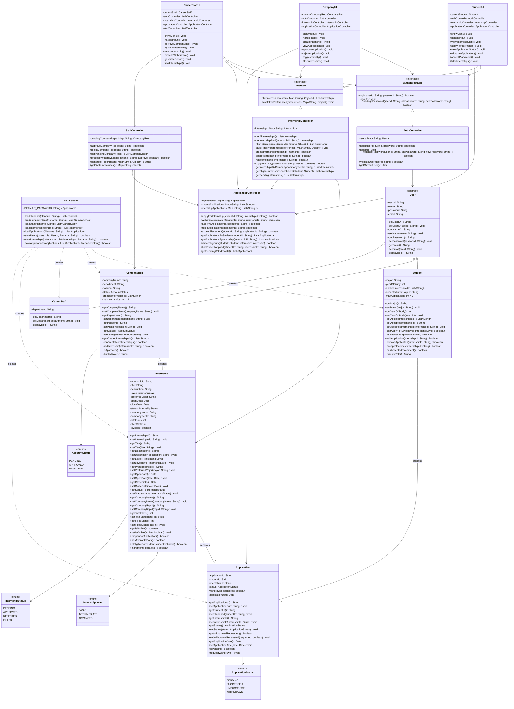

```mermaid
classDiagram

    class CSVLoader {
        -DEFAULT_PASSWORD: String = "password"
        +loadStudents(filename: String) List~Student~
        +loadCompanyReps(filename: String) List~CompanyRep~
        +loadStaff(filename: String) List~CareerStaff~
        +loadInternships(filename: String) List~Internship~
        +loadApplications(filename: String) List~Application~
        +saveUsers(users: List~User~, filename: String) boolean
        +saveInternships(internships: List~Internship~, filename: String) boolean
        +saveApplications(applications: List~Application~, filename: String) boolean
    }

    class User {
        <<abstract>>
        -userId: String
        -name: String
        -password: String
        -email: String
        +getUserID() String
        +setUserID(userId: String) void
        +getName() String
        +setName(name: String) void
        +getPassword() String
        +setPassword(password: String) void
        +getEmail() String
        +setEmail(email: String) void
        +displayRole() String
    }

    class Student {
        -major: String
        -yearOfStudy: int
        -appliedInternshipIds: List~String~
        -acceptedInternshipId: String
        -maxApplications: int = 3
        +getMajor() String
        +setMajor(major: String) void
        +getYearOfStudy() int
        +setYearOfStudy(year: int) void
        +getAppliedInternshipIds() List~String~
        +getAcceptedInternshipId() String
        +setAcceptedInternshipId(internshipId: String) void
        +canApplyForLevel(level: InternshipLevel) boolean
        +hasReachedApplicationLimit() boolean
        +addApplication(internshipId: String) boolean
        +removeApplication(internshipId: String) boolean
        +acceptPlacement(internshipId: String) boolean
        +hasAcceptedPlacement() boolean
        +displayRole() String
    }

    class CompanyRep {
        -companyName: String
        -department: String
        -position: String
        -status: AccountStatus
        -createdInternshipIds: List~String~
        -maxInternships: int = 5
        +getCompanyName() String
        +setCompanyName(companyName: String) void
        +getDepartment() String
        +setDepartment(department: String) void
        +getPosition() String
        +setPosition(position: String) void
        +getStatus() AccountStatus
        +setStatus(status: AccountStatus) void
        +getCreatedInternshipIds() List~String~
        +canCreateMoreInternships() boolean
        +addInternship(internshipId: String) boolean
        +isApproved() boolean
        +displayRole() String
    }

    class CareerStaff {
        -department: String
        +getDepartment() String
        +setDepartment(department: String) void
        +displayRole() String
    }

    class Internship {
        -internshipId: String
        -title: String
        -description: String
        -level: InternshipLevel
        -preferredMajor: String
        -openDate: Date
        -closeDate: Date
        -status: InternshipStatus
        -companyName: String
        -companyRepId: String
        -totalSlots: int
        -filledSlots: int
        -isVisible: boolean
        +getInternshipId() String
        +setInternshipId(id: String) void
        +getTitle() String
        +setTitle(title: String) void
        +getDescription() String
        +setDescription(description: String) void
        +getLevel() InternshipLevel
        +setLevel(level: InternshipLevel) void
        +getPreferredMajor() String
        +setPreferredMajor(major: String) void
        +getOpenDate() Date
        +setOpenDate(date: Date) void
        +getCloseDate() Date
        +setCloseDate(date: Date) void
        +getStatus() InternshipStatus
        +setStatus(status: InternshipStatus) void
        +getCompanyName() String
        +setCompanyName(companyName: String) void
        +getCompanyRepId() String
        +setCompanyRepId(repId: String) void
        +getTotalSlots() int
        +setTotalSlots(slots: int) void
        +getFilledSlots() int
        +setFilledSlots(slots: int) void
        +getIsVisible() boolean
        +setIsVisible(visible: boolean) void
        +isOpenForApplication() boolean
        +hasAvailableSlots() boolean
        +isEligibleForStudent(student: Student) boolean
        +incrementFilledSlots() boolean
    }

    class Application {
        -applicationId: String
        -studentId: String
        -internshipId: String
        -status: ApplicationStatus
        -withdrawalRequested: boolean
        -applicationDate: Date
        +getApplicationId() String
        +setApplicationId(id: String) void
        +getStudentId() String
        +setStudentId(studentId: String) void
        +getInternshipId() String
        +setInternshipId(internshipId: String) void
        +getStatus() ApplicationStatus
        +setStatus(status: ApplicationStatus) void
        +getWithdrawalRequested() boolean
        +setWithdrawalRequested(requested: boolean) void
        +getApplicationDate() Date
        +setApplicationDate(date: Date) void
        +isPending() boolean
        +requestWithdrawal() void
    }

    %% ========== INTERFACES ==========
    class Authenticatable {
        <<interface>>
        +login(userId: String, password: String) boolean
        +logout() void
        +changePassword(userId: String, oldPassword: String, newPassword: String) boolean
    }

    class Filterable {
        <<interface>>
        +filterInternships(criteria: Map~String, Object~) List~Internship~
        +saveFilterPreferences(preferences: Map~String, Object~) void
    }

    %% ========== CONTROLLERS ==========
    class AuthController {
        -users: Map~String, User~
        +login(userId: String, password: String) boolean
        +logout() void
        +changePassword(userId: String, oldPassword: String, newPassword: String) boolean
        +validateUser(userId: String) boolean
        +getCurrentUser() User
    }

    class InternshipController {
        -internships: Map~String, Internship~
        +getAllInternships() List~Internship~
        +getInternshipById(internshipId: String) Internship
        +filterInternships(criteria: Map~String, Object~) List~Internship~
        +saveFilterPreferences(preferences: Map~String, Object~) void
        +createInternship(internship: Internship) boolean
        +approveInternship(internshipId: String) boolean
        +rejectInternship(internshipId: String) boolean
        +toggleVisibility(internshipId: String, visible: boolean) boolean
        +getInternshipsByCompany(companyRepId: String) List~Internship~
        +getEligibleInternshipsForStudent(student: Student) List~Internship~
        +getPendingInternships() List~Internship~
    }

    class ApplicationController {
        -applications: Map~String, Application~
        -studentApplications: Map~String, List~String~~
        -internshipApplications: Map~String, List~String~~
        +applyForInternship(studentId: String, internshipId: String) boolean
        +withdrawApplication(studentId: String, internshipId: String) boolean
        +approveApplication(applicationId: String) boolean
        +rejectApplication(applicationId: String) boolean
        +acceptPlacement(studentId: String, applicationId: String) boolean
        +getApplicationsByStudent(studentId: String) List~Application~
        +getApplicationsByInternship(internshipId: String) List~Application~
        +checkEligibility(student: Student, internship: Internship) boolean
        +hasStudentApplied(studentId: String, internshipId: String) boolean
        +getPendingWithdrawals() List~Application~
    }

    class StaffController {
        -pendingCompanyReps: Map~String, CompanyRep~
        +approveCompanyRep(repId: String) boolean
        +rejectCompanyRep(repId: String) boolean
        +getPendingCompanyReps() List~CompanyRep~
        +processWithdrawal(applicationId: String, approve: boolean) boolean
        +generateReport(filters: Map~String, Object~) String
        +getSystemStatistics() Map~String, Object~
    }

    %% ========== UI CLASSES ==========
    class StudentUI {
        -currentStudent: Student
        -authController: AuthController
        -internshipController: InternshipController
        -applicationController: ApplicationController
        +showMenu() void
        +handleInput() void
        +viewInternshipList() void
        +applyForInternship() void
        +viewApplicationStatus() void
        +withdrawApplication() void
        +acceptPlacement() void
        +filterInternships() void
    }

    class CompanyUI {
        -currentCompanyRep: CompanyRep
        -authController: AuthController
        -internshipController: InternshipController
        -applicationController: ApplicationController
        +showMenu() void
        +handleInput() void
        +createInternship() void
        +viewApplications() void
        +approveApplication() void
        +rejectApplication() void
        +toggleVisibility() void
        +filterInternships() void
    }

    class CareerStaffUI {
        -currentStaff: CareerStaff
        -authController: AuthController
        -internshipController: InternshipController
        -applicationController: ApplicationController
        -staffController: StaffController
        +showMenu() void
        +handleInput() void
        +approveCompanyRep() void
        +approveInternship() void
        +rejectInternship() void
        +processWithdrawal() void
        +generateReport() void
        +filterInternships() void
    }

    %% ========== ENUMS ==========
    class InternshipLevel {
        <<enum>>
        BASIC
        INTERMEDIATE
        ADVANCED
    }

    class ApplicationStatus {
        <<enum>>
        PENDING
        SUCCESSFUL
        UNSUCCESSFUL
        WITHDRAWN
    }

    class InternshipStatus {
        <<enum>>
        PENDING
        APPROVED
        REJECTED
        FILLED
    }

    class AccountStatus {
        <<enum>>
        PENDING
        APPROVED
        REJECTED
    }

    %% ========== RELATIONSHIPS ==========
    %% Inheritance
    User <|-- Student
    User <|-- CompanyRep
    User <|-- CareerStaff

    %% Model Associations
    Student "1" -- "*" Application : submits
    CompanyRep "1" -- "*" Internship : creates
    Internship "1" -- "*" Application : receives

    %% Interface Implementations
    Authenticatable <|.. AuthController
    Filterable <|.. InternshipController

    %% UI Dependencies (Dependency Inversion)
    StudentUI --> Authenticatable
    StudentUI --> Filterable
    StudentUI --> ApplicationController
    
    CompanyUI --> Authenticatable
    CompanyUI --> Filterable
    CompanyUI --> ApplicationController
    
    CareerStaffUI --> Authenticatable
    CareerStaffUI --> Filterable
    CareerStaffUI --> ApplicationController
    CareerStaffUI --> StaffController

    %% Controller Dependencies
    AuthController --> User
    InternshipController --> Internship
    ApplicationController --> Application
    StaffController --> CompanyRep

    %% Data Management
    CSVLoader ..> Student : creates
    CSVLoader ..> CompanyRep : creates
    CSVLoader ..> CareerStaff : creates
    CSVLoader ..> Internship : creates
    CSVLoader ..> Application : creates

    %% Enum Usage
    Internship --> InternshipLevel
    Internship --> InternshipStatus
    Application --> ApplicationStatus
    CompanyRep --> AccountStatus

    %% Internal Controller Coordination
    InternshipController --> ApplicationController
    StaffController --> ApplicationController
```
