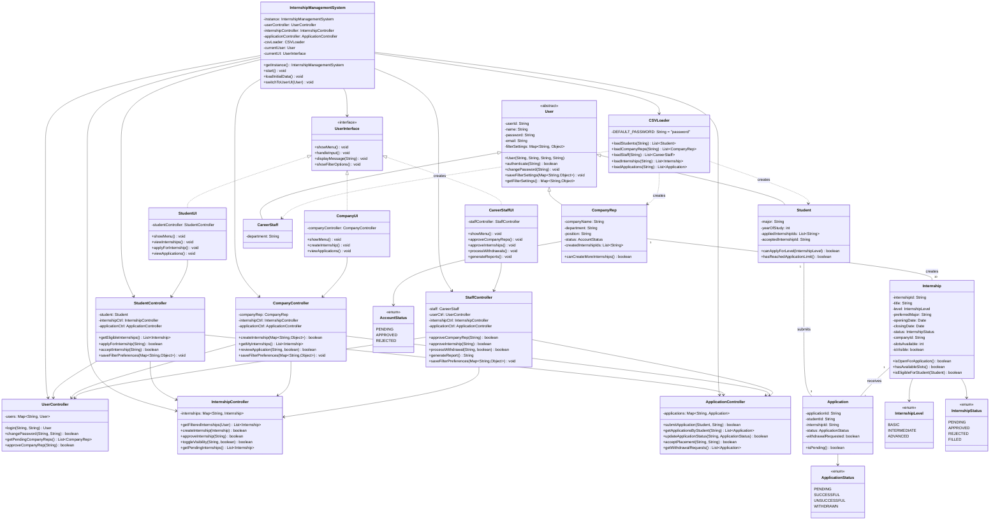

```mermaid
classDiagram
    %% ========== CORE SYSTEM ==========
    class InternshipManagementSystem {
        -instance: InternshipManagementSystem
        -userController: UserController
        -internshipController: InternshipController
        -applicationController: ApplicationController
        -csvLoader: CSVLoader
        -currentUser: User
        -currentUI: UserInterface
        +getInstance() InternshipManagementSystem
        +start() void
        +loadInitialData() void
        +switchToUserUI(User) void
    }

    %% ========== DATA LAYER ==========
    class CSVLoader {
        -DEFAULT_PASSWORD: String = "password"
        +loadStudents(String) List~Student~
        +loadCompanyReps(String) List~CompanyRep~
        +loadStaff(String) List~CareerStaff~
        +loadInternships(String) List~Internship~
        +loadApplications(String) List~Application~
    }

    %% ========== UI LAYER (ISP) ==========
    class UserInterface {
        <<interface>>
        +showMenu() void
        +handleInput() void
        +displayMessage(String) void
        +showFilterOptions() void
    }

    class StudentUI {
        -studentController: StudentController
        +showMenu() void
        +viewInternships() void
        +applyForInternship() void
        +viewApplications() void
    }

    class CompanyUI {
        -companyController: CompanyController
        +showMenu() void
        +createInternship() void
        +viewApplications() void
    }

    class CareerStaffUI {
        -staffController: StaffController
        +showMenu() void
        +approveCompanyReps() void
        +approveInternships() void
        +processWithdrawals() void
        +generateReports() void
    }

    %% ========== CONTROLLER LAYER (SRP) ==========
    class UserController {
        -users: Map~String, User~
        +login(String, String) User
        +changePassword(String, String) boolean
        +getPendingCompanyReps() List~CompanyRep~
        +approveCompanyRep(String) boolean
    }

    class InternshipController {
        -internships: Map~String, Internship~
        +getFilteredInternships(User) List~Internship~
        +createInternship(Internship) boolean
        +approveInternship(String) boolean
        +toggleVisibility(String, boolean) boolean
        +getPendingInternships() List~Internship~
    }

    class ApplicationController {
        -applications: Map~String, Application~
        +submitApplication(Student, String) boolean
        +getApplicationsByStudent(String) List~Application~
        +updateApplicationStatus(String, ApplicationStatus) boolean
        +acceptPlacement(String, String) boolean
        +getWithdrawalRequests() List~Application~
    }

    class StudentController {
        -student: Student
        -internshipCtrl: InternshipController
        -applicationCtrl: ApplicationController
        +getEligibleInternships() List~Internship~
        +applyForInternship(String) boolean
        +acceptInternship(String) boolean
        +saveFilterPreferences(Map~String,Object~) void
    }

    class CompanyController {
        -companyRep: CompanyRep
        -internshipCtrl: InternshipController
        -applicationCtrl: ApplicationController
        +createInternship(Map~String,Object~) boolean
        +getMyInternships() List~Internship~
        +reviewApplication(String, boolean) boolean
        +saveFilterPreferences(Map~String,Object~) void
    }

    class StaffController {
        -staff: CareerStaff
        -userCtrl: UserController
        -internshipCtrl: InternshipController
        -applicationCtrl: ApplicationController
        +approveCompanyRep(String) boolean
        +approveInternship(String) boolean
        +processWithdrawal(String, boolean) boolean
        +generateReport() String
        +saveFilterPreferences(Map~String,Object~) void
    }

    %% ========== MODEL LAYER (LSP) ==========
    class User {
        <<abstract>>
        -userId: String
        -name: String
        -password: String
        -email: String
        -filterSettings: Map~String, Object~
        +User(String, String, String, String)
        +authenticate(String) boolean
        +changePassword(String) void
        +saveFilterSettings(Map~String,Object~) void
        +getFilterSettings() Map~String,Object~
    }

    class Student {
        -major: String
        -yearOfStudy: int
        -appliedInternshipIds: List~String~
        -acceptedInternshipId: String
        +canApplyForLevel(InternshipLevel) boolean
        +hasReachedApplicationLimit() boolean
    }

    class CompanyRep {
        -companyName: String
        -department: String
        -position: String
        -status: AccountStatus
        -createdInternshipIds: List~String~
        +canCreateMoreInternships() boolean
    }

    class CareerStaff {
        -department: String
    }

    class Internship {
        -internshipId: String
        -title: String
        -level: InternshipLevel
        -preferredMajor: String
        -openingDate: Date
        -closingDate: Date
        -status: InternshipStatus
        -companyId: String
        -slotsAvailable: int
        -isVisible: boolean
        +isOpenForApplication() boolean
        +hasAvailableSlots() boolean
        +isEligibleForStudent(Student) boolean
    }

    class Application {
        -applicationId: String
        -studentId: String
        -internshipId: String
        -status: ApplicationStatus
        -withdrawalRequested: boolean
        +isPending() boolean
    }

    %% ========== ENUMS ==========
    class InternshipLevel {
        <<enum>>
        BASIC
        INTERMEDIATE
        ADVANCED
    }

    class ApplicationStatus {
        <<enum>>
        PENDING
        SUCCESSFUL
        UNSUCCESSFUL
        WITHDRAWN
    }

    class InternshipStatus {
        <<enum>>
        PENDING
        APPROVED
        REJECTED
        FILLED
    }

    class AccountStatus {
        <<enum>>
        PENDING
        APPROVED
        REJECTED
    }

    %% ========== RELATIONSHIPS ==========
    %% Core System
    InternshipManagementSystem --> UserController
    InternshipManagementSystem --> StudentController
    InternshipManagementSystem --> CompanyController
    InternshipManagementSystem --> StaffController
    InternshipManagementSystem --> InternshipController
    InternshipManagementSystem --> ApplicationController
    InternshipManagementSystem --> CSVLoader
    InternshipManagementSystem --> UserInterface

    %% UI Layer (ISP)
    UserInterface <|.. StudentUI
    UserInterface <|.. CompanyUI
    UserInterface <|.. CareerStaffUI

    %% Inheritance (LSP)
    User <|-- Student
    User <|-- CompanyRep
    User <|-- CareerStaff

    %% UI-Controller (DIP)
    StudentUI --> StudentController
    CompanyUI --> CompanyController
    CareerStaffUI --> StaffController

    %% Controller Coordination (SRP)
    StudentController --> UserController
    StudentController --> InternshipController
    StudentController --> ApplicationController
    CompanyController --> UserController
    CompanyController --> InternshipController
    CompanyController --> ApplicationController
    StaffController --> UserController
    StaffController --> InternshipController
    StaffController --> ApplicationController

    %% Data Creation
    CSVLoader ..> Student : creates
    CSVLoader ..> CompanyRep : creates
    CSVLoader ..> CareerStaff : creates

    %% Enum Usage
    Internship --> InternshipLevel
    Internship --> InternshipStatus
    Application --> ApplicationStatus
    CompanyRep --> AccountStatus

    %% Model Associations
    Student "1" -- "3" Application : submits
    CompanyRep "1" -- "10" Internship : creates
    Internship "1" -- "*" Application : receives

```
