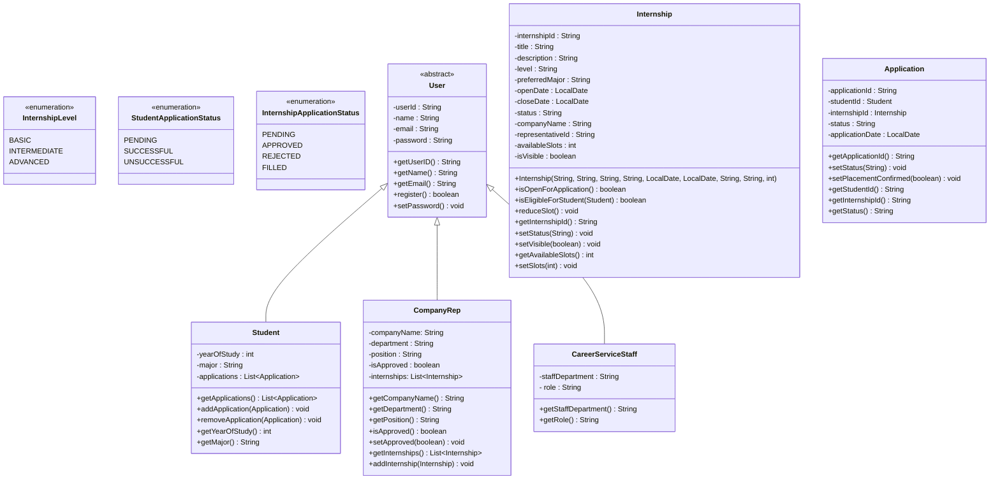

# Class Diagram

```mermaid
classDiagram
    %% ========== ENUMERATIONS ==========
    class InternshipLevel {
        <<enumeration>>
        BASIC
        INTERMEDIATE
        ADVANCED
    }

    class StudentApplicationStatus {
        <<enumeration>>
        PENDING
        SUCCESSFUL
        UNSUCCESSFUL
    }

    class InternshipApplicationStatus {
        <<enumeration>>
        PENDING
        APPROVED
        REJECTED
        FILLED
    }


    %% User-related classes
    class User {
        <<abstract>>
        -userId : String
        -name : String
        -email : String
        -password : String 
        +getUserID() String 
        +getName() String
        +getEmail() String
        +register() boolean
        +setPassword() void
    }
    
    class Student{
        -yearOfStudy : int
        -major : String
        -applications : List~Application~
        +getApplications() List~Application~
        +addApplication(Application) void
        +removeApplication(Application) void
        +getYearOfStudy() int
        +getMajor() String
    }

    class CompanyRep{
        -companyName: String
        -department : String
        -position : String
        -isApproved : boolean
        -internships: List~Internship~ 
        +getCompanyName() String
        +getDepartment() String
        +getPosition() String
        +isApproved() boolean
        +setApproved(boolean) void
        +getInternships() List~Internship~
        +addInternship(Internship) void
    }

    class CareerServiceStaff{
        -staffDepartment : String
        - role : String
        +getStaffDepartment() String
        +getRole() String

    }

    %% ========== ENTITY CLASSES ==========
    class Internship {
        -internshipId : String
        -title : String
        -description : String
        -level : String
        -preferredMajor : String
        -openDate : LocalDate
        -closeDate : LocalDate
        -status : String
        -companyName : String
        -representativeId : String
        -availableSlots : int
        -isVisible : boolean
        +Internship(String, String, String, String, LocalDate, LocalDate, String, String, int)
        +isOpenForApplication() boolean
        +isEligibleForStudent(Student) boolean
        +reduceSlot() void
        +getInternshipId() String
        +setStatus(String) void
        +setVisible(boolean) void
        +getAvailableSlots() int
        +setSlots(int) void
    }

    class Application {
        -applicationId : String
        -studentId : Student
        -internshipId : Internship
        -status : String
        -applicationDate : LocalDate
        +getApplicationId() String
        +setStatus(String) void
        +setPlacementConfirmed(boolean) void
        +getStudentId() String
        +getInternshipId() String
        +getStatus() String
    }

    
    %% Relationships

    %% Inheritance
    User <|-- Student
    User <|-- CompanyRep
    User <|-- CareerServiceStaff
```