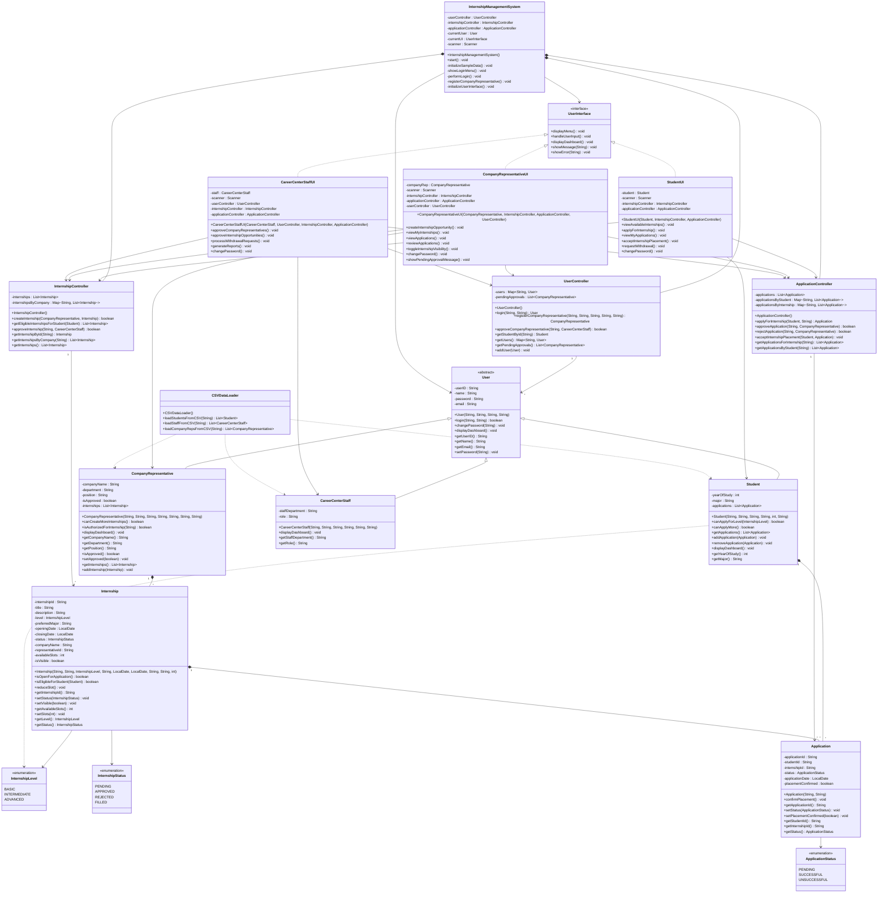

```mermaid
classDiagram
    %% ========== ENUMERATIONS ==========
    class InternshipLevel {
        <<enumeration>>
        BASIC
        INTERMEDIATE
        ADVANCED
    }

    class ApplicationStatus {
        <<enumeration>>
        PENDING
        SUCCESSFUL
        UNSUCCESSFUL
    }

    class InternshipStatus {
        <<enumeration>>
        PENDING
        APPROVED
        REJECTED
        FILLED
    }

    %% ========== USER HIERARCHY ==========
    class User {
        <<abstract>>
        -userID : String
        -name : String
        -password : String
        -email : String
        +User(String, String, String, String)
        +login(String, String) boolean
        +changePassword(String) void
        +displayDashboard() void
        +getUserID() String
        +getName() String
        +getEmail() String
        +setPassword(String) void
    }

    class Student {
        -yearOfStudy : int
        -major : String
        -applications : List~Application~
        +Student(String, String, String, String, int, String)
        +canApplyForLevel(InternshipLevel) boolean
        +canApplyMore() boolean
        +getApplications() List~Application~
        +addApplication(Application) void
        +removeApplication(Application) void
        +displayDashboard() void
        +getYearOfStudy() int
        +getMajor() String
    }

    class CompanyRepresentative {
        -companyName : String
        -department : String
        -position : String
        -isApproved : boolean
        -internships : List~Internship~
        +CompanyRepresentative(String, String, String, String, String, String, String)
        +canCreateMoreInternships() boolean
        +isAuthorizedForInternship(String) boolean
        +displayDashboard() void
        +getCompanyName() String
        +getDepartment() String
        +getPosition() String
        +isApproved() boolean
        +setApproved(boolean) void
        +getInternships() List~Internship~
        +addInternship(Internship) void
    }

    class CareerCenterStaff {
        -staffDepartment : String
        -role : String
        +CareerCenterStaff(String, String, String, String, String, String)
        +displayDashboard() void
        +getStaffDepartment() String
        +getRole() String
    }

    %% ========== INTERFACE ==========
    class UserInterface {
        <<interface>>
        +displayMenu() void
        +handleUserInput() void
        +displayDashboard() void
        +showMessage(String) void
        +showError(String) void
    }

    class StudentUI {
        -student : Student
        -scanner : Scanner
        -internshipController : InternshipController
        -applicationController : ApplicationController
        +StudentUI(Student, InternshipController, ApplicationController)
        +viewAvailableInternships() void
        +applyForInternship() void
        +viewMyApplications() void
        +acceptInternshipPlacement() void
        +requestWithdrawal() void
        +changePassword() void
    }

    class CompanyRepresentativeUI {
        -companyRep : CompanyRepresentative
        -scanner : Scanner
        -internshipController : InternshipController
        -applicationController : ApplicationController
        -userController : UserController
        +CompanyRepresentativeUI(CompanyRepresentative, InternshipController, ApplicationController, UserController)
        +createInternshipOpportunity() void
        +viewMyInternships() void
        +viewApplications() void
        +reviewApplications() void
        +toggleInternshipVisibility() void
        +changePassword() void
        +showPendingApprovalMessage() void
    }

    class CareerCenterStaffUI {
        -staff : CareerCenterStaff
        -scanner : Scanner
        -userController : UserController
        -internshipController : InternshipController
        -applicationController : ApplicationController
        +CareerCenterStaffUI(CareerCenterStaff, UserController, InternshipController, ApplicationController)
        +approveCompanyRepresentatives() void
        +approveInternshipOpportunities() void
        +processWithdrawalRequests() void
        +generateReports() void
        +changePassword() void
    }

    %% ========== ENTITY CLASSES ==========
    class Internship {
        -internshipId : String
        -title : String
        -description : String
        -level : InternshipLevel
        -preferredMajor : String
        -openingDate : LocalDate
        -closingDate : LocalDate
        -status : InternshipStatus
        -companyName : String
        -representativeId : String
        -availableSlots : int
        -isVisible : boolean
        +Internship(String, String, InternshipLevel, String, LocalDate, LocalDate, String, String, int)
        +isOpenForApplication() boolean
        +isEligibleForStudent(Student) boolean
        +reduceSlot() void
        +getInternshipId() String
        +setStatus(InternshipStatus) void
        +setVisible(boolean) void
        +getAvailableSlots() int
        +setSlots(int) void
        +getLevel() InternshipLevel
        +getStatus() InternshipStatus
    }

    class Application {
        -applicationId : String
        -studentId : String
        -internshipId : String
        -status : ApplicationStatus
        -applicationDate : LocalDate
        -placementConfirmed : boolean
        +Application(String, String)
        +confirmPlacement() void
        +getApplicationId() String
        +setStatus(ApplicationStatus) void
        +setPlacementConfirmed(boolean) void
        +getStudentId() String
        +getInternshipId() String
        +getStatus() ApplicationStatus
    }

    %% ========== CONTROLLER CLASSES ==========
    class UserController {
        -users : Map~String, User~
        -pendingApprovals : List~CompanyRepresentative~
        +UserController()
        +login(String, String) User
        +registerCompanyRepresentative(String, String, String, String, String) CompanyRepresentative
        +approveCompanyRepresentative(String, CareerCenterStaff) boolean
        +getStudentById(String) Student
        +getUsers() Map~String, User~
        +getPendingApprovals() List~CompanyRepresentative~
        +addUser(User) void
    }

    class InternshipController {
        -internships : List~Internship~
        -internshipsByCompany : Map~String, List~Internship~~
        +InternshipController()
        +createInternship(CompanyRepresentative, Internship) boolean
        +getEligibleInternshipsForStudent(Student) List~Internship~
        +approveInternship(String, CareerCenterStaff) boolean
        +getInternshipById(String) Internship
        +getInternshipsByCompany(String) List~Internship~
        +getInternships() List~Internship~
    }

    class ApplicationController {
        -applications : List~Application~
        -applicationsByStudent : Map~String, List~Application~~
        -applicationsByInternship : Map~String, List~Application~~
        +ApplicationController()
        +applyForInternship(Student, String) Application
        +approveApplication(String, CompanyRepresentative) boolean
        +rejectApplication(String, CompanyRepresentative) boolean
        +acceptInternshipPlacement(Student, Application) void
        +getApplicationsForInternship(String) List~Application~
        +getApplicationsByStudent(String) List~Application~
    }

    class CSVDataLoader {
        +CSVDataLoader()
        +loadStudentsFromCSV(String) List~Student~
        +loadStaffFromCSV(String) List~CareerCenterStaff~
        +loadCompanyRepsFromCSV(String) List~CompanyRepresentative~
    }

    class InternshipManagementSystem {
        -userController : UserController
        -internshipController : InternshipController
        -applicationController : ApplicationController
        -currentUser : User
        -currentUI : UserInterface
        -scanner : Scanner
        +InternshipManagementSystem()
        +start() void
        -initializeSampleData() void
        -showLoginMenu() void
        -performLogin() void
        -registerCompanyRepresentative() void
        -initializeUserInterface() void
    }

    %% ========== RELATIONSHIPS ==========
    User <|-- Student
    User <|-- CompanyRepresentative
    User <|-- CareerCenterStaff

    UserInterface <|.. StudentUI
    UserInterface <|.. CompanyRepresentativeUI
    UserInterface <|.. CareerCenterStaffUI

    InternshipManagementSystem *-- UserController
    InternshipManagementSystem *-- InternshipController
    InternshipManagementSystem *-- ApplicationController

    Student "1" *-- "*" Application
    CompanyRepresentative "1" *-- "*" Internship
    Internship "1" *-- "*" Application

    UserController "1" --> "*" User
    InternshipController "1" --> "*" Internship
    ApplicationController "1" --> "*" Application

    StudentUI --> Student
    StudentUI --> InternshipController
    StudentUI --> ApplicationController

    CompanyRepresentativeUI --> CompanyRepresentative
    CompanyRepresentativeUI --> InternshipController
    CompanyRepresentativeUI --> ApplicationController
    CompanyRepresentativeUI --> UserController

    CareerCenterStaffUI --> CareerCenterStaff
    CareerCenterStaffUI --> UserController
    CareerCenterStaffUI --> InternshipController
    CareerCenterStaffUI --> ApplicationController

    CSVDataLoader ..> Student
    CSVDataLoader ..> CareerCenterStaff
    CSVDataLoader ..> CompanyRepresentative

    InternshipManagementSystem --> User
    InternshipManagementSystem --> UserInterface

    %% ========== ENUM USAGE ==========
    Internship --> InternshipLevel
    Internship --> InternshipStatus
    Application --> ApplicationStatus
    Student ..> InternshipLevel
```